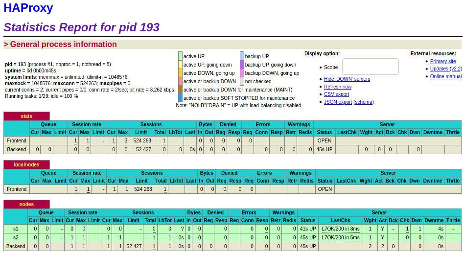
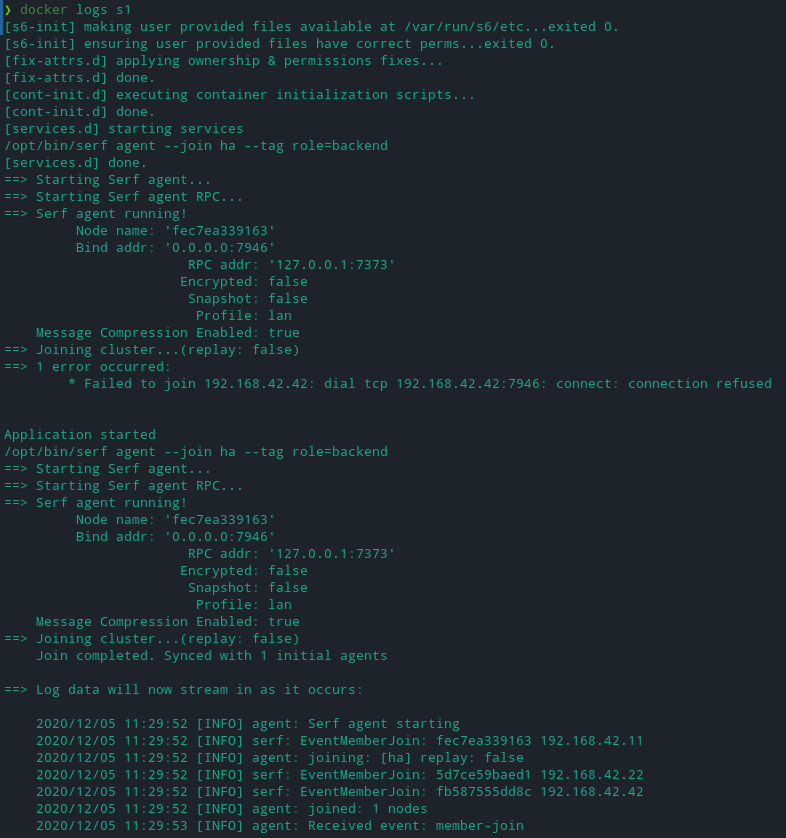
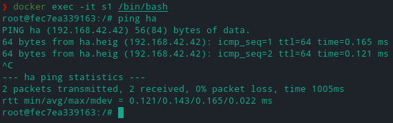
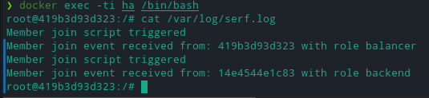
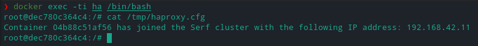

# Lab report - 04 Docker 

by Bonzon Tiffany, Scherer Laurent, Thoeny Laurent


### Introduction

### Table of content

### 

### Task 0: Identify issues and install the tools

*[M1]* : The configuration from the previous lab was specifying the servers in the config file, this is a problem as we expect scalability through a dynamic server poll. In the best case scenario we expect our load balancer to start or power off containers to match the current traffic. 

Another part of the problem is the issue with the web servers, killing a container and starting another one will force every client connected to that first web server to start a new session on the second one, to reconnect, maybe to re-add stuff to their cart. This is a significant inconvenience for the user.

At last, what could (and should) happen is that the newly created container take the address of the previous one, but I assume there are cases it could lead to a problem, we should not depend on a fixed IP address in the config.

*[M2]* : In order to add a new container to the server poll, we need to modify the configuration file for our proxy (`haproxy.cfg`), we need to add the new server in the `backend nodes` category. That forces us to update the config file in the docker template directory to allow the image to be built with the changes AND to update the current running containers by accessing their shell, editing the file then telling haproxy to consider the changes.

*[M3]* : A better approach would be to manage the containers dynamically, even if Haproxy doesn't kill or start any container based on the traffic, it still should be able to detect new containers and remove deleted one without any modification in his config.

*[M4]* : The best approach would be for the server containing the `webapp` to announce themselves as a service and for the load balancer to be able to detect the service containers automatically, we used `Traefik` and its label system in another class to do such a task. Another alternative would be to configure the server using an IP range and to assign the `webapp` containers to that range. 

*[M5]* : I don't think it'll be a problem to run a new service on our infrastructure, we can create a container with the service we want and either have that container contact the machines identified as `webapp` or add to the configuration of the containers configuration that they need to send their logs.

We'll typically prefer a pull solution in this case, we want our service to contact the containers and not the opposite. 

Alternatively we could consider implementing our new service on the load balancers, but we wouldn't recommend that since restarting one means restarting both services and it's better to separate the tasks.

*[M6]* : todo

### 

### Task 1: Add a process supervisor to run several processes



##### Describe your difficulties for this task and your understanding of what is happening during this task. Explain in your own words why are we installing a process supervisor. Do not hesitate to do more research and to find more articles on that topic to illustrate the problem.

We haven't faced any difficulties during the copy-paste of lines from the lab instructions to either our terminal or config files.

We are installing a process supervisor in order to overcome the difficulties of running multiple process in a single Docker container, those difficulties are not issued from our configuration but based on the way Docker was designed. We want to have more than one process running on our container so we make the supervisor the main process and we let him run the other services.

### Task 2: Add a tool to manage membership in the web server cluster

In order to copy the agent run script and make it executable, we added the following command in both our Dockerfiles (inspired by the way we handled ha).

```
# TODO: [Serf] Add Serf S6 setup
COPY services/serf /etc/services.d/serf
RUN chmod +x /etc/services.d/serf/run
```

Then we build the containers and verify their behavior through the browser and the logs, we see that the behavior is the one expected from the lab instructions where we get a failure to join the cluster at first, however we can see that the node then joined with the IP 192.168.42.42 (it's HA ip address) successfully.



The next thing we did verify is to connect to s1 and to ping ha to verify if this behavior was indeed due to the name being properly resolved, it was.



From this point the following indicated way to start the container was not implemented, since starting them with `docker-compose up --build` allowed us to have them connect properly.

*Since my behavior is different, let me specify my Docker version : Docker version 19.03.13-ce, build 4484c46d9d and docker-compose version 1.27.4*


##### Deliverables

The logs at the end of the second task have been exported to the corresponding folder, logs export were done using `docker logs <container> >> file`.

We haven't faced the problem where we need to start `s1` and `s2` before starting `ha`, however it's obviously a big problem if you need to link the containers that way, future containers wouldn't be able to reach `ha` because of the same problem. The easier solution is to allow the containers to resolve ha.

The way `Serf` works is with a `gossip protocol`, it's a way to design the communication that has his name issued from the analogy of workers spreading rumors, everyone periodically talks to someone else randomly and the information therefore spreads. There is another analogy that calls such a communication scheme an `epidemic protocol`, as a parallel can be made between the way the information spread and a virus would spread
(source)[https://en.wikipedia.org/wiki/Gossip_protocol].

One of the other way for the discovery to happen on Docker is the way used by `Traefik` (already used as an example earlier), Traefik discovery uses an access to the Docker API to detect running containter and information on these containers to detect the services. In our case we would allow `ha` to use the Docker API and tell him that every container with a LABEL `backend` is a container running the webapp.

The fondamental difference between these approach is that the way we configure the discovery from our proxy instance is not different from how we could do it with an infrastructure not based on Docker, where the method using `Docker API` is obviously based on using Docker.

### Task 3: React to membership changes

In order to copy the scripts we added the following commands in our Dockerfile.

``` 
# [Serf] Copy events handler scripts
RUN mkdir -p /serf-handlers
COPY scripts/member-join.sh /serf-handlers/member-join.sh
COPY scripts/member-leave.sh /serf-handlers/member-leave.sh
RUN chmod +x /serf-handlers/*
```

##### Deliverables

We started the ha image only and saved the logs in the `haonly` file, after that we started `s1` and kept both logs in the files `s1started` and `haands1`.

*"Once started, get the logs (keep the logs) of the backend container."* -> We just captured the logs from `s1` as it has just started so we're not sure if another one was needed but assumed it would be the same since we haven't changed anything from the last step.

Below are the logs from the container running, they also were copied in the `logsinha` file.



It asks for the logs of the three containers but we haven't started `s2` during the task. We assumed that "Now, run one of the two backend containers and capture the logs (keep the logs)." followed by both commands just meant we could choose which to start.

The only difference is that the behavior of `s1` would have been duplicated as `s2` has the exact same image.

### Task 4: Use a template engine to easily generate configuration files

In order to copy the config in `/config` we added the following lines to our Dockerfile 

```
# TODO: [HB] Copy the haproxy configuration template
RUN mkdir -p /config
COPY config/haproxy.cfg.hb /config/haproxy.cfg.hb
```

Then we ran the containers and went to check the file `/tmp/haproxy.cfg`, the result is shown below and copy-pasted in the file `tmpconf` in the logs of this task. We notice there is only one line written.



Now moving on to the end-to-end testing.

After starting s1 : `Container 7f9f21fca48b has joined the Serf cluster with the following IP address: 192.168.42.2` then after starting s2 as well : `Container 7f04a57729fa has joined the Serf cluster with the following IP address: 192.168.42.3`.

In the screenshot above we noticed there was only one line written despite both containers behind started, by this end-to-end step we have confirmed that the behavior is correct but only one line is written in the file at any time. If we wanted every connexion to be logged in the file we would have to modify the script `member-join.sh` and to use `>>` instead of `>` when writing the file in `/tmp`.

##### Deliverables

1. Mostly the difference between both method is the way the layers are used, if we happend `RUN ... install xz-utils` at the end of our Dockerfile then it would've been shoter to build the image, where our choice made us rebuild from the LAYER where the RUN command was executed. However our choice seems much cleaner when someone reads the Dockerfile and checks what's installed to the container via `apt`.

We suggest using the command chaining version as long as the image isn't one that has to be modified a lot, it's much easier for people reading the Dockerfile.

You can reduce the size of docker containers through flattining, that mostly involves creating an image of the container with each of your layer to reduce the space used. We won't go into details but a few of the possibilites are mentionned in (that cool post in the forums)[https://forums.docker.com/t/how-to-flatten-an-image-with-127-parents/1600/4]. Another quick recap about this (here)[https://l10nn.medium.com/flattening-docker-images-bafb849912ff].

2. A different approach from ours would be to create a base image for both our containers and then 2 images from that common part. We would leave most of the installations and common parts in the base image, then `FROM` this base image create our two variants with the differences related to the webapp and the proxy. 

While this approach seems a bit *overkill* for our needs, it's definitely a good thing in bigger architectures where multiple servers have a lot of common properties, but that mean you have to rebuild every subimage every time you make a change so be careful !

3. Three files were created, the first one was mentionned earlier in the report and both other are named `afters1` and `afters2` to refer what they represent.

Then 4 files named `dockerps`, `inspectha`, `inspects1` and `inspects2` were created with the additionnal logs required.

4. We assume the problem you want us to refer is the one we described earlier about the fact that every time we write the file `/tmp/haproxy.cfg` it overrides its current content.

### Task 5: Generate a new load balancer configuration when membership changes

### Difficulties

### Conclusion

